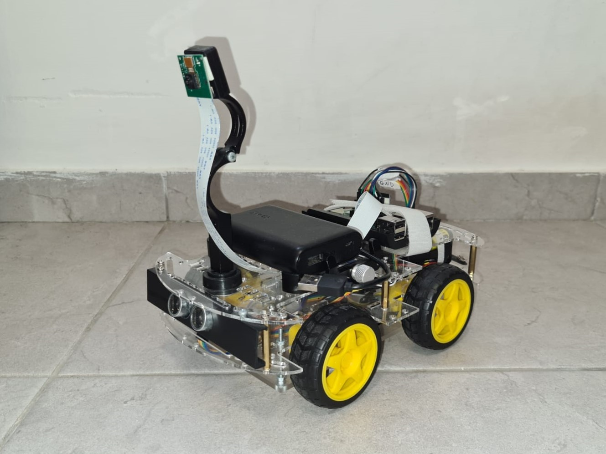

# Autonomous RC Car
## This is still a work in progress
Autonomous rc car using neural networks



### Table Of Contents
- [Description](#description)
- [Usage](#usage)

---

## Description
In this project i've built an autonomous RC car with lane keeping capabilities using a CNN model, stop sign detection and front collision detection.

The lane keeping (or autonomous steering) and stop sign detection is implemented using only the camera.
The front collision detection is implemented using an ultrasonic distance sensor.

## Usage
```python
car = AutonomousCar()
car.drive()
```


